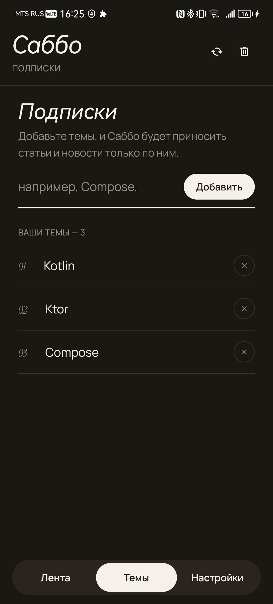
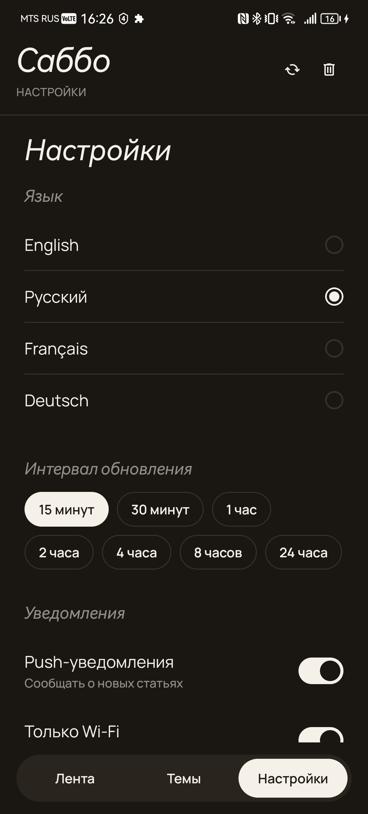

# Sabbo - агрегатор новостей по темам

## Скриншоты

<table>
  <tr>
    <th>Лента</th>
    <th>Темы</th>
    <th>Настройки</th>
  </tr>
  <tr>
    <td></td>
    <td></td>
    <td></td>
  </tr>
</table>

## Функциональность

1. Подписка на темы (произвольные ключевые слова) и лента статей по ним
2. Фильтр ленты по конкретной теме или по всем сразу
3. Фоновое обновление статей по расписанию (WorkManager) с учётом языка, интервала и Wi-Fi-only
4. Уведомление о новых статьях после фонового обновления
5. Очистка загруженных статей
6. Настройки: язык статей, интервал обновления, уведомления, обновление только по Wi-Fi (хранятся в DataStore)
7. Обработка ошибок сети и HTTP-ошибок API с понятными сообщениями пользователю

## Стек


## Архитектура

Четыре модуля: `app → presentation, data → domain`. `domain` — чистый Kotlin-модуль (`java-library`), ничего не знает про Android; `data` и `presentation` зависят только от него, а `app` собирает их вместе.

- **domain** — сущности (`Article`, `Settings`, `RefreshConfig`, `AppHttpException`), интерфейсы репозиториев (`ArticleRepository`, `TopicRepository`, `SettingsRepository`) и use-case'ы, сгруппированные по фиче (`usecase/article`, `usecase/topic`, `usecase/settings`) — каждый use-case решает одну задачу и вызывается как функция (`operator fun invoke`).
- **data** — реализации репозиториев поверх Room (`ArticlesDao`, `TopicsDao`, `NewsDatabase`) и Ktor (`NewsApi` → NewsAPI.org, эндпоинт `/v2/everything`); `RefreshDataWorker` (Hilt-интегрированный `CoroutineWorker`) обновляет статьи по всем темам в фоне и показывает уведомление через `NotificationsHelper`; периодичность и сетевые условия (Wi-Fi-only) настраиваются через `WorkManager`-констрейнты в `ArticleRepositoryImpl.startBackgroundRefresh`. DI-модули (`di/`) собраны на Hilt.
- **presentation** — экран = пакет `screen/<name>/` с Compose-функцией, `ViewModel` и `State`, по паттерну **Intent/Effect**: экран отправляет `Intent`, `ViewModel` обновляет `State` и шлёт разовые `Effect` (навигация, снэкбары) через `Channel`. Навигация — `Navigation Compose` с type-safe маршрутами (`@Serializable` в `navigation/routes.kt`), три экрана: `feed`, `topics`, `settings`.
- **app** — `Application` (`App`), точка сборки DI-графа Hilt; `AppStartupManager` при старте приложения подписывается на `Settings` и переустанавливает фоновое обновление (`StartRefreshDataUseCase`) при каждом изменении настроек.

DI — Hilt везде, кроме `domain` (там его быть не может — модуль не Android). WorkManager получает воркеры через `HiltWorkerFactory`, прокинутую в `Configuration.Provider` в `App`.

Ключ NewsAPI не хардкожен в коде — он читается из `keystore.properties` (см. ниже) и пробрасывается в `BuildConfig.NEWS_API_KEY` на этапе сборки `data`-модуля.

## Как собрать и запустить

Требования: Android Studio (актуальная версия с поддержкой Kotlin 2.4 / KSP), JDK 17+.

1. Получить бесплатный API-ключ на [newsapi.org](https://newsapi.org/).
2. Скопировать `keystore.properties.example` в `keystore.properties` (в корне проекта) и вписать ключ:
   ```
   NEWS_API_KEY=<ваш ключ>
   ```
3. Собрать проект — без сети на этом шаге, кроме загрузки зависимостей Gradle, не обойтись (ключ подставляется в `BuildConfig` на этапе конфигурации).

- `minSdk` 30, `targetSdk` 36.
- База данных локальная (Room), сервер собственный не нужен — только внешний NewsAPI.

```powershell
.\gradlew.bat assembleDebug          # собрать debug APK
.\gradlew.bat installDebug           # собрать и поставить на подключённое устройство/эмулятор
.\gradlew.bat test                   # юнит-тесты
.\gradlew.bat connectedAndroidTest    # instrumented-тесты (нужен эмулятор/устройство)
```

Либо открыть проект в Android Studio и запустить конфигурацию `app` на эмуляторе/устройстве с API 30+.

## Известные ограничения / что не реализовано

Часть пунктов — осознанные упрощения ради фокуса на учебных задачах (модульная архитектура, WorkManager, Ktor), а не забытый функционал:

- **Бесплатный тариф NewsAPI не работает на реальных публичных серверах** — эндпоинт `/v2/everything` при сборке release/публикации потребует платный план или проксирующий бэкенд; для локальной разработки и учебных целей достаточно free-плана.
- **Нет пагинации ленты** — статьи по теме загружаются одним запросом целиком, без подгрузки по скроллу.
- **Нет полноценного офлайн-режима** — без сети показываются только ранее загруженные статьи, без явного индикатора "офлайн".
- **Нет удаления отдельной статьи** — очистка возможна только целиком по всем темам (`ClearAllArticlesUseCase`).
- **Язык статей общий для всех тем** — нельзя задать разный язык поиска для разных тем одновременно.
